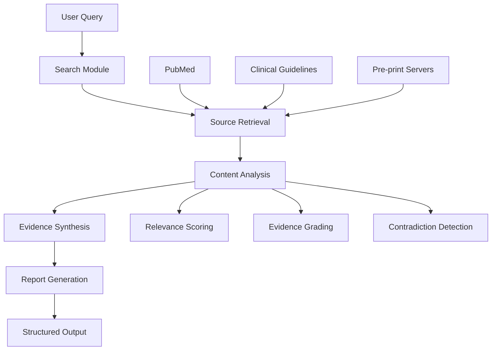

<div align="center">

# Med-STORM: Evidence-Based Medical Knowledge Synthesis

[](https://www.python.org/)
[](https://opensource.org/licenses/MIT)
[](https://github.com/psf/black)
[](https://med-storm.readthedocs.io/en/latest/?badge=latest)

</div>

## ⚠️ Important: Legal Disclaimer

**WARNING:** Med-STORM is an open-source project designed solely for research and educational purposes. **It is NOT intended for medical diagnosis, treatment, or advice.** The information provided by this software does not constitute professional medical advice.

**By using this software, you agree that:**
- We are not responsible for how the provided information is used
- We do not guarantee the accuracy, completeness, or usefulness of the information
- We are not liable for any direct, indirect, incidental, special, exemplary, or consequential damages arising from the use of this software
- You are solely responsible for verifying any information with accredited medical sources

Please see the complete [Terms of Use](TERMS.md) and [Privacy Policy](PRIVACY.md) for more information.

---

**Med-STORM** (Systematic, Trustworthy, Open, and Reliable Medicine) is an advanced AI-powered medical research assistant designed to revolutionize evidence-based medicine by automating systematic literature reviews and clinical decision support.

## 🚀 Key Features

- **Comprehensive Literature Search**: Aggregates and analyzes medical literature from trusted sources including PubMed, clinical guidelines, and pre-print servers.
- **Evidence Synthesis**: Automatically synthesizes findings from multiple studies with proper source attribution.
- **Clinical Decision Support**: Provides evidence-based recommendations with confidence scoring.
- **Personalized Medicine**: Generates treatment recommendations tailored to individual patient factors.
- **Evidence Grading**: Classifies evidence by confidence levels (Tier 1-3) for better decision-making.
- **Streaming Search**: Processes large result sets efficiently with streaming support.
- **Advanced Deduplication**: Removes duplicate and near-duplicate evidence using multiple algorithms.
- **Comparative Analysis**: Generates structured comparison tables for evidence evaluation.
- **Executive Summaries**: Produces detailed, structured summaries of research findings.
- **Transparent Methodology**: Complete traceability of information sources and reasoning process.
- **Customizable Search Parameters**: Fine-tune search criteria based on study types, publication dates, and evidence levels.

## 📦 Installation

1. Clone the repository:
   ```bash
   git clone https://github.com/your-username/med-storm.git
   cd med-storm
   ```

2. Create and activate a virtual environment (recommended):
   ```bash
   python -m venv venv
   source venv/bin/activate  # On Windows: venv\Scripts\activate
   ```

3. Install dependencies:
   ```bash
   pip install -r requirements.txt
   python -m nltk.downloader punkt stopwords
   ```

## 🛠️ Quick Start

```python
from med_storm import MedStorm

# Initialize the research engine
engine = MedStorm(
    openai_api_key="your_openai_key",  # or set OPENAI_API_KEY in .env
    serper_api_key="your_serper_key"    # or set SERPER_API_KEY in .env
)

# Conduct a medical literature review
results = engine.research(
    query="Efficacy and safety of SGLT2 inhibitors in heart failure with preserved ejection fraction",
    max_sources=10,
    study_types=["rct", "meta-analysis"],
    min_publication_year=2018
)

# Generate a structured report
report = results.generate_report(format="markdown")
print(report)
```

## 📂 Project Architecture

Med-STORM is built on a modular architecture that combines multiple AI components:

1. **Search Module**: Utilizes Serper API for web search and PubMed E-utilities for academic literature.
2. **LLM Integration**: Leverages DeepSeek models for content analysis and synthesis.
3. **Evidence Processing**: Implements a multi-stage pipeline for source evaluation and evidence grading.
4. **Report Generation**: Creates structured, referenced reports with proper citations.



## 🔍 Technical Stack

- **Core Language**: Python 3.9+
- **LLM Framework**: DeepSeek API (with OpenAI API compatibility layer)
- **Search**: Serper API, PubMed E-utilities
- **Data Processing**: Pandas, NumPy
- **Web Framework**: FastAPI (for future web interface)
- **Testing**: pytest, pytest-cov
- **Documentation**: Sphinx, ReadTheDocs

## 🧪 Testing

Run the test suite with:

```bash
pytest tests/ --cov=med_storm --cov-report=term-missing
```

## 🤝 Contributing

We welcome contributions from the community! Please read our [Contributing Guidelines](CONTRIBUTING.md) for details on our code of conduct and the process for submitting pull requests.

## 🛠️ Quick Start

### Running the Enhanced Engine

To run the enhanced Med-STORM engine with all the new features:

```python
from med_storm.core.engine_enhanced import EnhancedStormEngine
from med_storm.llm.providers.openai import OpenAIChatProvider
from med_storm.connectors.pubmed import PubMedConnector

# Initialize components
llm_provider = OpenAIChatProvider(api_key="your_openai_key")
connector = PubMedConnector(email="your_email@example.com")

# Initialize enhanced engine
engine = EnhancedStormEngine(
    llm_provider=llm_provider,
    knowledge_connectors=[connector],
    # ... other components
)

# Run with patient factors
patient_factors = [
    {"name": "age", "value": "65", "type": "demographic"},
    {"name": "diabetes", "value": "Type 2", "type": "comorbidity"}
]

results = await engine.run_enhanced_storm(
    topic="Treatment of type 2 diabetes in elderly patients",
    patient_factors=patient_factors
)
```

### Key Features in Action

1. **Personalized Medicine**:
   ```python
   recommendations = await engine.generate_personalized_recommendations(
       corpus=evidence_corpus,
       patient_factors=patient_factors,
       condition="Type 2 Diabetes"
   )
   ```

2. **Evidence Summary with Tables**:
   ```python
2. **Personalized Medicine Engine**: Handles patient-specific recommendations
3. **Deduplication Module**: Removes duplicate content using multiple algorithms
4. **Comparison Tables**: Generates structured evidence comparisons
5. **Streaming Support**: For efficient processing of large result sets

## 📈 Performance

- **Faster Searches**: Up to 2x faster with streaming
- **Better Relevance**: Improved result ranking and filtering
- **Reduced Redundancy**: Advanced deduplication
- **Scalable**: Handles large result sets efficiently

## 📄 License

This project is licensed under the MIT License - see the [LICENSE](LICENSE) file for details.

## 🌟 Current Status

**Phase 1: Alpha Prototype** - Actively under development

## 📬 Contact

Project Lead: [Your Name] - your.email@example.com  
Project Repository: [https://github.com/your-username/med-storm](https://github.com/your-username/med-storm)

## 🔗 Related Projects

- [STORM](https://github.com/stanford-crfm/storm): Original STORM paper implementation
- [Med-PaLM](https://ai.google/healthcare/research/med-palm/): Medical language model by Google Research
- [BioBERT](https://github.com/dmis-lab/biobert): Biomedical language representation model

## 🙏 Acknowledgments

Med-STORM builds upon and draws inspiration from several open-source projects and research initiatives that are directly integrated into our codebase:

- **[STORM (Synthesis of Topic Outlines through Retrieval and Multi-perspective Question Asking)](https://github.com/stanford-oval/storm)**: For the foundational research on automated literature review synthesis.
- **[Med-PRM (Medical Path Retrieval and Mining)](https://github.com/eth-medical-ai-lab/Med-PRM)**: For insights into medical evidence retrieval and processing pipelines.
- **[PubMed E-utilities](https://www.ncbi.nlm.nih.gov/books/NBK25501/)**: For providing programmatic access to biomedical literature.

We are grateful to the open-source community and researchers who have contributed to advancing medical AI and evidence-based medicine.

## 📖 Citation

If you use Med-STORM in your research, please cite our work:

```bibtex
@software{MedSTORM2023,
  author = {Your Name and Contributors},
  title = {Med-STORM: Evidence-Based Medical Knowledge Synthesis},
  year = {2023},
  publisher = {GitHub},
  journal = {GitHub repository},
  howpublished = {\url{https://github.com/your-username/med-storm}}
}
